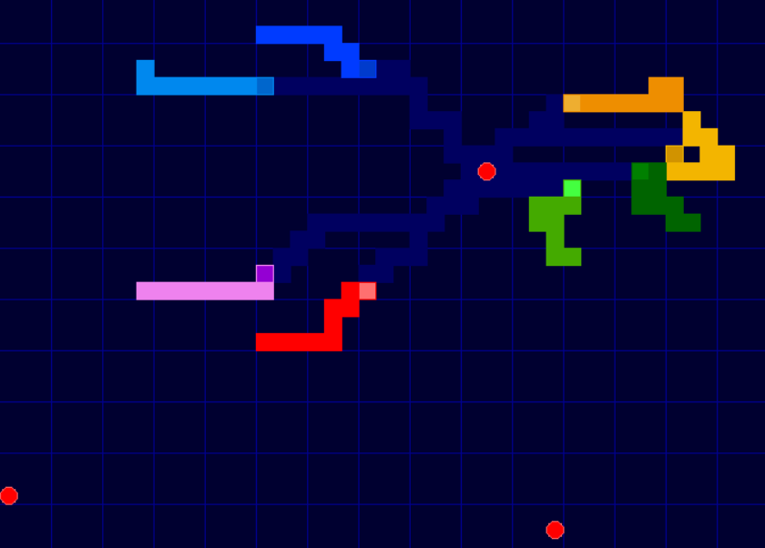
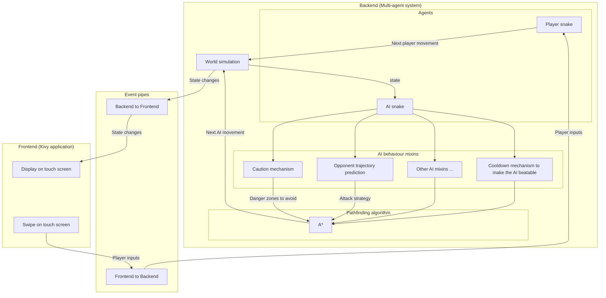
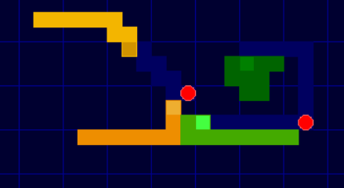

# 🐍 Snake / Tron 🏍️

> **A Snake and Tron-inspired mobile game exploring pathfinding and autonomous AI in a multi-agent system**



<!-- TODO: améliorer les screenshots :

- Mettre un extrait de gameplay vidéo au début de la section principale `# Snake Tron`

- Mettre un screenshot pour illustrer chaque mécanisme d'IA dans les sous-section de `## 🤖 AI snake agents`
 -->


Snake Tron is a grid-based game inspired by **Snake** and **Tron**, built in Python with [Kivy](https://kivy.org/).

The game combines human-controlled snakes with autonomous AI opponents. Rather than relying on predefined movement patterns, the AI dynamically plans its moves using **A\* pathfinding**, opponent trajectory prediction, virtual danger zones and spatial analysis.

The project also serves as an exploration of **pathfinding, multi-agent behaviour and real-time decision making** within a relatively simple game environment.

---

## 🎮 Gameplay

Several snakes compete simultaneously in the same arena. Each snake:

* moves continuously on a discrete grid;
* can wrap around the edges of the arena;
* grows by collecting food;
* can collide with other snakes;
* can collide with itself and cut its own tail;
* can die and respawn after a configurable cooldown.

The arena is **periodic**: leaving the board on one side makes the snake reappear on the opposite side.

Any number of snakes can compete in the arena, with a configurable mix of human players and AI-controlled opponents.


---

## 👥 Players and AIs in a multi-agent system

Snake Tron uses a relatively simple game environment, implemented as a multi-agent system, to experiment with several interacting mechanisms.

Players can compete alongside AI-controlled snakes. Both players and AIs are agents operating within the same world and are subject to the same game rules. Their decisions therefore directly interact with one another within the same environment.

Players can control their snakes using the keyboard, with different key bindings such as the arrow keys, `ZQSD` or `IJKL`, or through touchscreen swipe controls on mobile devices.

AI snakes independently compute their decisions based on information observable in the world, such as the position and movement of other agents, without knowing whether they are controlled by a player or another AI.

---

## 🔬 Code Architecture

The project is divided into three main areas:

| Backend | Frontend | Event pipe |
| --- | --- | --- |
| `SnakeWorld` computes the game state by simulating the game and its rules, taking into account decisions made by agents (human players or AI).<br><br>AI snake agents compute their next decision based on the current game state.<br><br>Human and AI-controlled snakes implement the same agent interface `AbstractSnakeAgent`, allowing `SnakeWorld` to handle them uniformly. | Renders the arena, the snakes, and the food. Displays scores and provides a pause menu.<br><br>Implemented with **Kivy** for mobile support.<br><br>Supports keyboard and swipe controls, with multi-touch input allowing multiple players to play on the same device. | Decouples the simulation from the graphical layer and handles communication between them. <br><br>**Backend → Frontend:** state changes such as snake movement, snake spawning, snake death, food creation or food consumption.<br><br>**Frontend → Backend:** player inputs and requests to add or remove snakes.

The following diagram shows a simplified data flow of the application:



---


## 🤖 AI snake agents


The main goal of the project is not just to recreate Snake or Tron, but to experiment with autonomous agents capable of reasoning about their environment.

Two types of AI behaviours are currently implemented, both built around an A* pathfinding algorithm developed from scratch in the backend.



### 🍎 Passive AI

The passive AI is an agent whose objective is to feed itself and grow as quickly as possible while avoiding obstacles. It follows the shortest path to the nearest food while avoiding cells occupied by:

* its own tail;
* the bodies of other agents, including the player.

However, at each game step, the position of the obstacles in the world changes as all agents move. To adapt to these changes, the passive AI dynamically recomputes its path at every step using the A* algorithm.


### ⏱️Making AI beatable (cooldown mechanism)

AI has a tunable "cooldown" mechanism which controls how frequently it can recompute its path. It is used to make the AI less reactive to changes in the game state, giving the player more opportunities to outmaneuver it.

**This cooldown mechanism is implemented in the `CooldownAISnakeMixin`.**


### 🎯 Offensive AI (attack strategy)

The offensive AI extends the passive behaviour with an **attack strategy**. It is an agent that tries to place its tail in front of its target's head in order to kill it. If the agent cannot find a path that allows it to attack its target, it instead moves towards the closest food, similarly to the passive AI.

To search for an attack path, the agent assumes that its target will not change direction during the next few game steps. The cells directly ahead of the target's head are therefore considered potential impact points.

The attacker uses the A* algorithm to compute the shortest paths from its head to the potential impact points. Given one of these paths `path`, we define the following quantities:

* `len(path)` is the number of steps required for the attacker to reach the impact point by following the path `path` computed by A*.
* `len(agent)` is the length of the attacker's body.
* `impact_delay` is the straight-line distance between the target's head and the impact point. It is the number of steps required for the target to reach the impact point if it never changes direction.

`advance = impact_delay - len(path)` is the number of steps by which the attacker reaches the impact point ahead of its target. The attacker must reach the impact point strictly before its target, which imposes `advance > 0`. However, for the target to actually collide the attacker's tail, the attacker must not reach the impact point too far in advance. This imposes `advance < len(agent)`.

The path `path` is therefore a valid attack if and only if `0 < advance < len(agent)`, i.e. if the length of the path `path` is strictly between `impact_delay - len(agent)` and `impact_delay`:

**`impact_delay - len(agent) < len(path) < impact_delay`**

Among all those valid attacks, the agent chooses the one that:

1. minimizes `impact_delay`, so that the attack is as unexpected as possible for the target;
2. minimizes `len(path)`, so that the attacker has the shortest possible distance to cover to perform the attack.

**This search algorithm is implemented in the `AttackAISnakeMixin`.**


### 🚧 Making AI more cautious (caution mechanism)

AI has a tunable "caution" mechanism. When it is enabled, cells surrounding the heads of other snakes are temporarily marked as dangerous. The AI can therefore ask A* to find paths that stay outside these dynamically generated danger zones.

**This caution mechanism is implemented in the `CautionAISnakeMixin`**

### 🧩 Creating new AI behaviours

The AI code architecture relies on **composing mixins** to combine independent strategies. This design allows to easily to create new AI behaviours by combining existing mixins or implementing new ones.

For example, the offensive AI agent combines attack, caution and cooldown mixins :

```py
class OffensiveAISnakeAgent(
    AttackAISnakeMixin,
    CautionAISnakeMixin,
    CooldownAISnakeMixin,
    AbstractAISnakeAgent
): ...
```

This approach keeps each mechanism independent and makes it possible to experiment with new behaviours without having to rewrite the core of the AI agent.

---

## 🗺️ Efficient spawning system

Respawning is another part of the project. When a snake which has previously been eliminated needs to respawn, the game has to find a position which is sufficiently far away from the other obstacles. This way the player is not instantly kill after respawn.

A naive approach would be to evaluate the distance of every $n$ grid cells against all $p$ obstacles. This would have a complexity of $O(p \cdot n)$.

Instead, the game tracks the currently occupied positions and computes a **Voronoi diagram** from them. It then searches for a Voronoi vertex that is sufficiently far from the surrounding occupied positions while remaining inside the arena. This provides a suitable respawn position in **O(p · log(p))**, where $p$ is the total number of occupied cells. Therefore the computation time grows only with the number of snakes and their length, but not with the size of the world.


---

## 🚀 Getting started

### Requirements

The project currently targets **Python 3.11** and uses:

* [Kivy](https://kivy.org/)
* [NumPy](https://numpy.org/)
* [SciPy](https://scipy.org/) (SciPy dependency is to be removed in the future)

The exact dependency versions are pinned in `requirements.txt`.

### Install dependencies

```bash
python -m pip install -r requirements.txt
```

### Run the game

From the `snaketron` directory:

```bash
python __main__.py
```

---

## 📦 Containerized development environment

The repository also provides a `Containerfile` and a `Makefile` for a reproducible development environment using **Podman**.

Build the environment:

```bash
make build
```

Run the game:

```bash
make run
```

Open a development/debug shell:

```bash
make debug
```

Clean the development environment:

```bash
make clean
```

The container configuration also takes into account graphical display forwarding, Wayland, GPU access and multitouch input devices where available.

---

## 📄 License

This project is distributed under the **GNU General Public License v3.0 (GPL-3.0)**.

See [`LICENSE`](LICENSE) for the complete license text.
